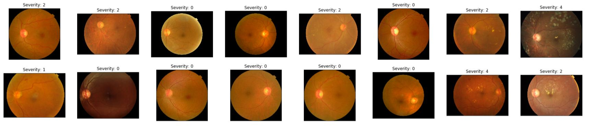
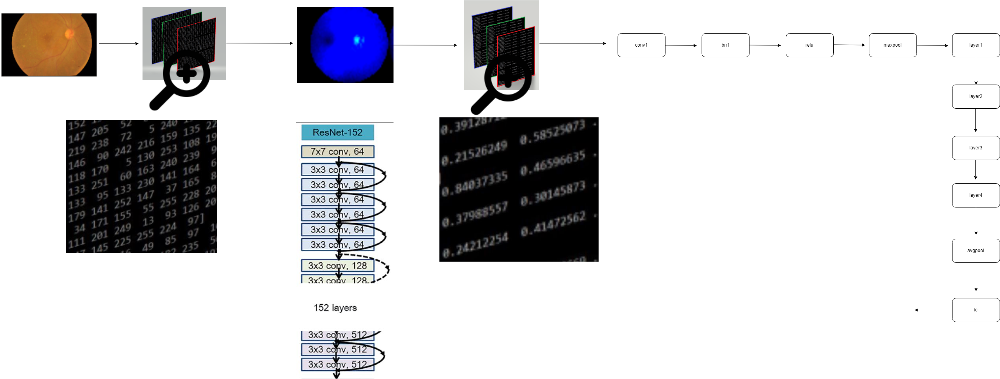
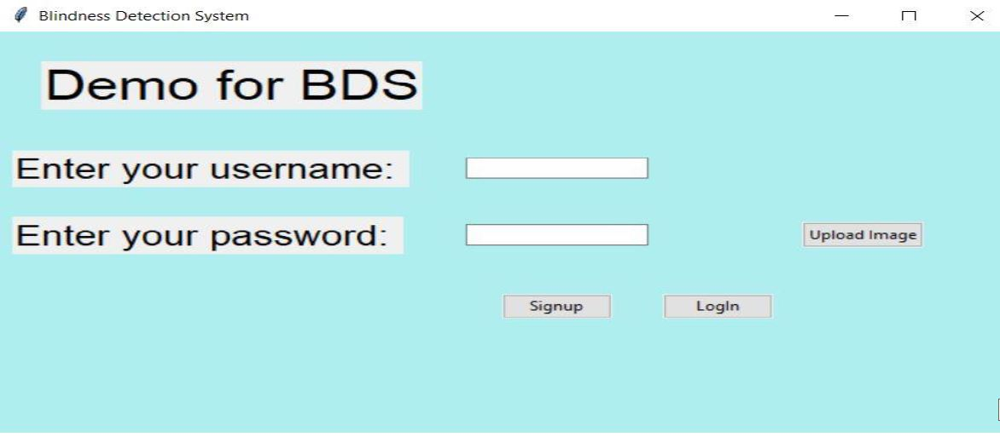
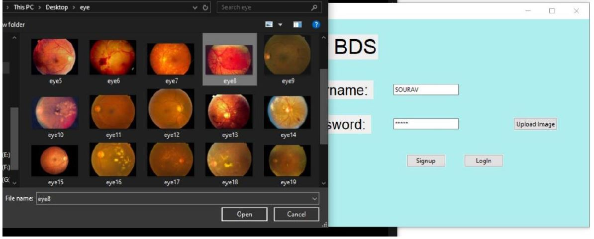
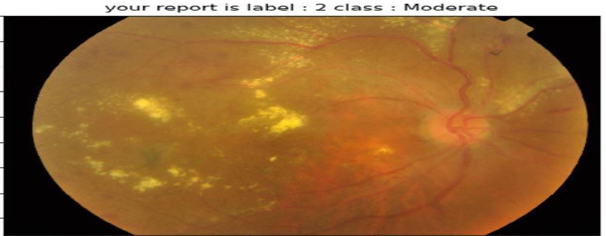
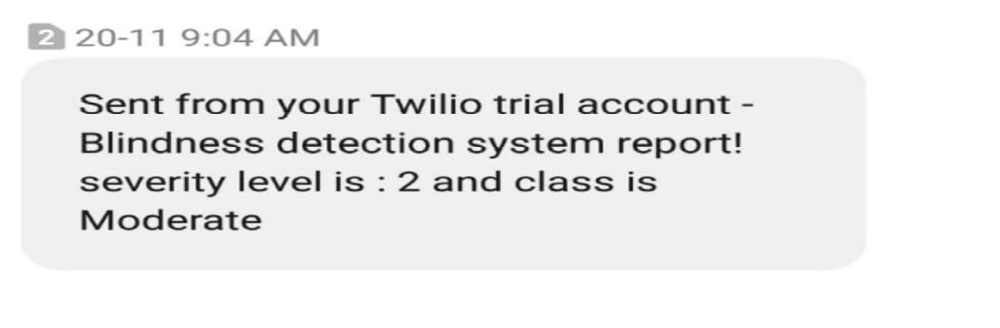

# Project Name : Retinal Blindness (Diabetic Retinopathy) Detection   

## Team Thiran
**Team Members:**
- Adithya S (Team Lead & ML Developer)
- Nhowmitha S (Backend Developer)
- Melkin S (Database & Integration)
- Bhavadharani G (Frontend & Testing)

**Project Year:** 2026

---

# Problem Statement :    
Diabetic Retinopathy is a disease with an increasing prevalence and the main cause of blindness among working-age population.  
The risk of severe vision loss can be significantly reduced by timely diagnosis and treatment. Systematic screening for DR has been identified as a cost-effective way to save health services resources. Automatic retinal image analysis is emerging as an important screening tool for early DR detection, which can reduce the workload associated to manual grading as well as save diagnosis costs and time. Many research efforts in the last years have been devoted to developing automated tools to help in the detection and evaluation of DR lesions.
We are interested in automating this predition using deep learning models.

# Motivation : 
Early detection through regular retinal screening can drastically reduce vision loss — yet, in many regions, access to skilled ophthalmologists remains limited.   
This project aims to leverage deep learning to assist hospitals and diagnostic centers in detecting Diabetic Retinopathy from retinal fundus images.  
Our motivation was to build an AI-driven, scalable, and cost-effective screening tool that can and by open-sourcing this work, the goal is to empower hospitals, clinics, and NGOs to:

- Support ophthalmologists in identifying DR at an early stage.
- Improve screening efficiency in under-resourced hospitals.
- Enable large-scale, real-time retinal analysis through automation.

By combining data-driven insights with medical imaging, the project demonstrates how AI can bridge the gap between healthcare accessibility and diagnostic accuracy, contributing toward the broader goal of preventing avoidable blindness.   

**Note:** This project was inspired by the mission of _**Aravind Eye Hospital (India)**_ and the _**Asia Pacific Tele-Ophthalmology Society (APTOS)**_, which aim to bring AI-assisted screening to remote areas.

# Dataset : [APOTS Kaggle Blindness dataset](https://www.kaggle.com/c/aptos2019-blindness-detection)      

# Solution :   
We have implemented a Deep Learning classification system using CNN pretrained model ResNet152 to classify severity levels of DR ranging from 0 (NO DR) to 4 (Proliferative DR).   
This is a collaborative project by Team Thiran, consisting of four members working on various aspects including model development, training, testing, database integration, and GUI development.
Our approach leverages transfer learning with ResNet152, taking advantage of pre-trained ImageNet weights and fine-tuning them for diabetic retinopathy detection.    
The system features a GUI-based interface built with Tkinter and uses MySQL database to securely maintain and store prediction records with user authentication.   
Twilio API integration enables SMS connectivity for patient notifications, ensuring timely communication of diagnostic results.       

# Summary of Technologies used in this project :       
| Dev Env. | Framework/ library/ languages |
| ------------- | ------------- |
| Backend development  | PyTorch (Deep learning framework) |
| Frontend development | Tkinter (Python GUI toolkit) |
| Database connectivity | MySQL Server |
| Programming Languages | Python, SQL |
| API | Twilio cloud API|      

# Data visualization :     
Input data (raw) is like this -     

# Resnet152 model summary :     
I have only shown below the main layers of resnet and each of the 'layer1', 'layer2', 'layer3' and 'layer4' contains various more layers.      

    

# Visualization of complete system :    
    

# Getting Started :       
Refer to [GettingStarted.md](GettingStarted.md) for detailed setup and installation instructions.

## Some snaps :     

       

 
 # Future Prospects :    
 * **Web Application Development**: Deploy the system as a web application using lightweight models for better performance and scalability.
 * **Privacy-Preserving Deep Learning**: Implement encryption techniques and privacy-preserving methods such as Federated Learning and Secure Multi-party Computation to ensure patient data confidentiality while maintaining high accuracy.
 * **Enhanced Security**: Achieving robust privacy protection is critical for medical datasets to establish trust among different stakeholders in the healthcare system.
 * **Concurrency Control**: Implement proper database locking mechanisms in MySQL to support multi-user access when deployed as a web service.
 * **Improved Diagnostic Accuracy**: Focus on reducing TYPE-II errors (false negatives), which are particularly critical in healthcare diagnostics to prevent missed diagnoses.
 * **Mobile Application**: Develop a mobile version for point-of-care screening in remote areas.   
 
# Project Structure :  
* **Training Code**: [`training.ipynb`](training.ipynb) - Model training implementation
* **Testing & Inference**: [`Single_test_inference.ipynb`](Single_test_inference.ipynb) - Testing on individual images
* **GUI Application**: [`blindness.py`](blindness.py) - Main application interface
* **Model Module**: [`model.py`](model.py) - Model loading and inference functions
* **SMS Integration**: [`send_sms.py`](send_sms.py) - Twilio API integration (optional)
* **Setup Guide**: [`GettingStarted.md`](GettingStarted.md) - Installation and configuration instructions
* **Sample Images**: [`sampleimages/`](sampleimages/) - Test retinal images for validation

**Note:** The model achieved 97% accuracy after extensive training (100+ epochs) on the APTOS Kaggle dataset.     

---

**Developed by Team Thiran** | *Empowering Healthcare through AI*
